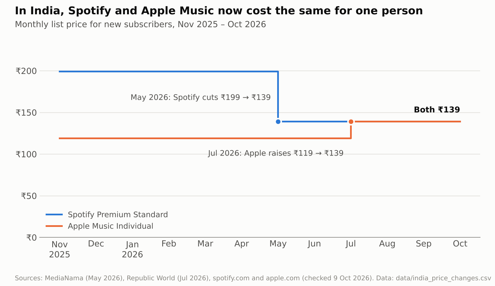
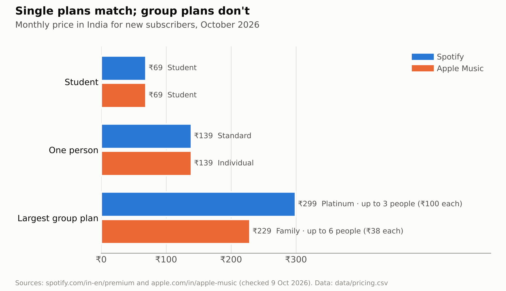

# Business Model and Strategy: Spotify vs. Apple Music

*Figures last checked: 9 October 2026. Price data: [data/pricing.csv](../data/pricing.csv) and [data/india_price_changes.csv](../data/india_price_changes.csv).*

## 1. Revenue streams

### Spotify
- **Subscriptions:** Premium plans bring in most of the revenue: €4.33 billion of €4.78 billion in Q2 2026.
- **Ad-supported free tier:** The free tier earns advertising revenue (€446 million in Q2 2026) and is the main entry point to Premium. It is still available in India.
- **Audiobooks:** In the US, Spotify also sells an Audiobooks Access plan with 15 hours of listening a month.

### Apple Music
- **Subscriptions only:** There is no free tier. New subscribers get the first month free.
- **Sold on its own and in bundles:** Apple Music can be bought by itself or as part of Apple One, which bundles it with other Apple services (from $21.95 a month in the US).

---

## 2. Average revenue per user (ARPU)

- **Spotify:** Premium ARPU was €4.89 a month in Q2 2026, well below the US list price because of lower prices in emerging markets and discounted Student and multi-person plans.
- **Apple Music:** Apple does not report Apple Music subscribers or ARPU separately, so a direct comparison is not possible. Apple One bundles also blur how much revenue each service earns.

---

## 3. Churn and retention

- **Spotify**
  - The **free tier** works as a conversion funnel into Premium.
  - The **Student plan** (₹69 in India) is a low-cost entry point.
  - In India, **Premium Platinum** (₹299) covers up to 3 people at the same address. Duo and Family plans have been closed to new Indian subscribers since November 2025.

- **Apple Music**
  - **Apple One bundles** raise switching costs by tying music to iCloud, TV+ and other services.
  - The **Family plan** covers up to 6 people for ₹229 in India.

---

## 4. Pricing

### India, October 2026 (monthly, new subscribers)

| Plan type | Spotify | Apple Music |
|---|---|---|
| Free | ₹0 (with ads) | Not offered (1-month free trial) |
| Student | ₹69 | ₹69 |
| One person | ₹139 (Standard, up to ~320 kbps) | ₹139 (Individual, lossless included) |
| One person, paid yearly | ₹1,390 prepaid (about ₹116 a month) | No annual option listed |
| Largest group plan | ₹299 (Platinum, up to 3 people, lossless) | ₹229 (Family, up to 6 people, lossless) |

### How India prices moved

| When | Change |
|---|---|
| Nov 2025 | Spotify launches a new lineup for new users (Lite ₹139, Standard ₹199, Student ₹99, Platinum ₹299) and closes Duo and Family to new users. |
| May 2026 | Spotify cuts Standard from ₹199 to ₹139 and Student from ₹99 to ₹69, and discontinues Lite. |
| Jul 2026 | Apple raises Individual from ₹119 to ₹139, Student from ₹59 to ₹69 and Family from ₹179 to ₹229. |

### United States, October 2026 (monthly)

| Plan | Spotify | Apple Music |
|---|---|---|
| Student | $6.99 | $6.99 |
| Individual | $12.99 | $11.99 |
| Duo | $18.99 | Not offered |
| Family | $21.99 | $19.99 |

---

## 5. Ecosystem and partnerships

- **Spotify**
  - Works on almost every device and platform, with no dependence on one ecosystem.
  - Integrates with third-party hardware and software, from smart speakers to DJ apps (Platinum in India includes DJ software integration).

- **Apple Music**
  - Tight integration with Siri, CarPlay, Apple Watch and HomePod.
  - Part of Apple's wider ecosystem and sold in Apple One bundles.

---

## 6. Summary

| Aspect | Spotify | Apple Music |
|---|---|---|
| Revenue model | Free tier with ads, plus paid Premium | Subscription only, also sold in bundles |
| ARPU | €4.89 Premium ARPU (Q2 2026); lower in emerging markets | Not disclosed; blurred by Apple One bundles |
| Growth strategy | Free-to-premium funnel and local pricing | Ecosystem-led retention and premium positioning |
| Main risk | Depends on converting free users and on ad revenue | Depends on Apple hardware adoption |

**Core insight:** Spotify competes on reach and conversion from a free tier, while Apple Music relies on its ecosystem to keep paying subscribers. In India, single plans now cost the same, so the difference has moved to group plans, audio quality and the free tier.

## Sources
- Spotify India Premium page: https://www.spotify.com/in-en/premium/
- Apple Music India page: https://www.apple.com/in/apple-music/
- Spotify US Premium page: https://www.spotify.com/us/premium/
- Apple Music US page: https://www.apple.com/apple-music/
- Rolling Stone India, Spotify's new Indian plans (13 Nov 2025): https://rollingstoneindia.com/spotify-premium-plans-india-new-prices-features/
- MediaNama, Spotify cuts prices and discontinues Lite (14 May 2026): https://www.medianama.com/2026/05/223-spotify-discontinues-premium-lite-india-cuts-prices-other-plans/
- Republic World, Apple Music price rise in India (19 Jul 2026): https://www.republicworld.com/tech/apple-music-apple-one-get-pricier-in-india-as-apple-hikes-subscription-rates-again-2026-07-19-132794
- Music Business Worldwide, Spotify Q2 2026 results: https://www.musicbusinessworldwide.com/spotify-hits-300-million-premium-subscribers-in-q2-202/
